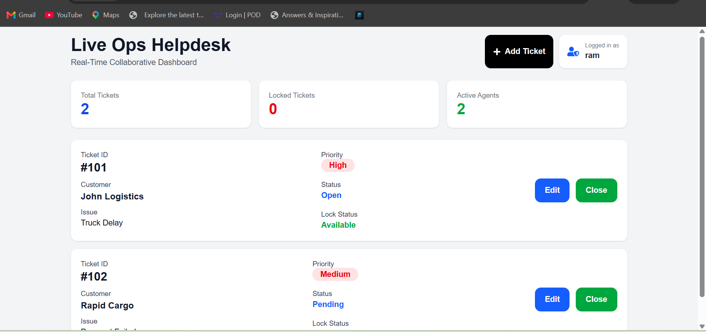

# Live Ops Helpdesk



🔗 Live Website: 

A real-time collaborative support dashboard built using Next.js, JavaScript, Tailwind CSS, and Socket.io.


## Project Overview

Live Ops Helpdesk is a real-time ticket management system designed to solve race condition problems in collaborative support environments.

When one agent edits a ticket, the ticket instantly becomes locked for all other connected agents. This prevents multiple users from editing the same ticket simultaneously.

The application uses WebSocket communication with Socket.io for real-time synchronization.

---

## Features

* Real-time ticket synchronization
* Ticket locking system
* Live collaborative dashboard
* Realtime ticket creation
* Lock owner validation
* Responsive UI
* Connection lost warning banner
* WebSocket communication using Socket.io
* Two-window live collaboration demo

---

## Tech Stack

### Frontend

* Next.js
* JavaScript
* Tailwind CSS
* React Icons
* Socket.io-client

### Backend

* Node.js
* Express.js
* Socket.io

---

## Installation

## Frontend Setup

```bash
npm install
npm run dev
```

Frontend runs on:

```bash
http://localhost:3000
```

---

## Backend Setup

Move to backend folder:

```bash
cd backend
```

Install dependencies:

```bash
npm install
```

Run backend server:

```bash
node server.js
```

Backend runs on:

```bash
http://localhost:5000
```

---

## Real-Time Features

### Ticket Locking

When Agent A clicks Edit:

* Ticket becomes locked instantly
* Other agents cannot edit
* Lock icon appears
* Ticket row becomes gray
* "Locked by Agent Name" message appears

### Ticket Unlocking

When the editing agent clicks Close:

* Ticket unlocks instantly
* Other agents regain access

### New Ticket Creation

When a new ticket is created:

* All connected users instantly receive the update
* No page refresh required

### Disconnect Handling

If socket connection is lost:

* Red warning banner appears
* User is informed that reconnection is happening

---

## Demo Instructions

1. Open application in two browser windows
2. Use different agent names
3. Edit a ticket in Window 1
4. Observe realtime lock in Window 2
5. Close the ticket
6. Observe realtime unlock
7. Create new ticket
8. Observe instant synchronization

---

## Project Purpose

This project demonstrates:

* WebSocket communication
* Real-time state synchronization
* Concurrency handling
* Race condition prevention
* Collaborative dashboard architecture

---

## Author

Dilkhush Kumar

Internship Project – Prodesk IT
